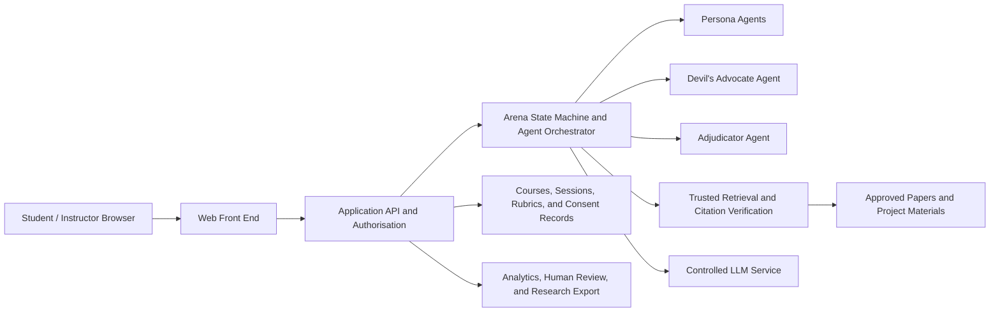

# GenAI Socratic Arena Website Plan

## 1. Product Positioning

The GenAI Socratic Arena should be developed as a teaching and research platform, not merely as a promotional website. It should serve four connected purposes:

1. Give students repeated, asynchronous opportunities to practise business debate.
2. Allow instructors to configure courses, scenarios, AI personas, assessment rubrics, and accessibility arrangements.
3. Allow research assistants to maintain the trusted knowledge base, prompt library, and evaluation datasets.
4. Capture authorised and de-identified learning data for project evaluation and research outputs.

The central product promise is that the AI does not answer on the student's behalf. Instead, multiple business personas challenge, question, and stress-test the student's reasoning before providing formative feedback.

The first release will be an English-language website. The interface and content model should nevertheless be designed so that additional languages can be introduced later without rebuilding the platform.

## 2. Recommended Product Scope

### 2.1 MVP Requirements

- Text-based debate; real-time voice is deferred to a later phase.
- Role-based access for students, instructors/research assistants, and system administrators. Research roles can be separated further when needed.
- Course and assignment entry points.
- One fully developed demonstration scenario and a reusable scenario template.
- Three debating personas, such as a sceptical CFO, a brand visionary, and a devil's advocate or logical-fallacy challenger.
- One Adjudicator Agent that observes but does not participate in the debate and produces formative feedback.
- Retrieval from a trusted knowledge base, with citations that students and instructors can open and verify.
- A structured debate flow with timed and untimed modes.
- A post-debate scorecard, dimension-level feedback, session history, and student progress view.
- Instructor tools for scenarios, personas, knowledge sources, rubrics, assignments, and session review.
- Consent records, de-identification, content reporting, human review, audit logs, and retention-based deletion.
- Basic research-data export, while keeping AI-generated scores separate from formal course grades by default.

### 2.2 Phase-Two Enhancements

- Voice input, speech playback, and spoken-delivery feedback.
- Team debates, live voting, and peer-coaching activities.
- Canvas or LMS single sign-on, roster synchronisation, and assignment integration.
- Additional interface and debate languages.
- More advanced instructor analytics, A/B testing, and cross-course comparisons.
- Grade synchronisation only after the scoring system has been adequately validated.

### 2.3 Out of Scope for the MVP

- Unrestricted autonomous conversations among multiple AI agents.
- Using AI-generated scores to determine formal grades automatically.
- Open-web retrieval as the default source of evidence.
- A complex real-time, multi-user audio or video classroom.
- Automatically using student conversations to train models.

## 3. Users and Permissions

| User | Primary objective | Core permissions |
|---|---|---|
| Student | Practise reasoning, decision-making, and communication | Join assigned debates, view sources and feedback, review personal history, use approved accessibility modes, and report content |
| Instructor / PI | Design learning activities and evaluate outcomes | Create courses and assignments, select rubrics, configure timing, review sessions and class trends, and revise AI feedback |
| Research Assistant / Content Editor | Maintain research evidence and pedagogical personas | Upload and approve sources, edit scenarios and persona prompts, manage versions, maintain evaluation sets, and conduct sampled double-rating |
| System Administrator | Keep the platform secure and reliable | Manage accounts and roles, data retention, auditing, system health, usage, cost, and incident response |

Permissions must be isolated by course and project. Students should see only their own detailed records. Instructors should see only their courses. Research exports should be de-identified by default.

## 4. Information Architecture and Page Inventory

### 4.1 Public Website

- `/`: Project proposition, learning value, demonstration entry point, and sign-in.
- `/about`: Pedagogical philosophy, the Socratic method, and the Sustainable Cycle.
- `/how-it-works`: The journey from scenario selection to the final scorecard.
- `/research`: Methodology, evaluation framework, project progress, and publications.
- `/resources`: Faculty guide, student handbook, example scenarios, and public materials.
- `/accessibility`: Accessibility features and accommodation arrangements.
- `/privacy`: Consent, data use, retention, deletion, and withdrawal information.
- `/contact`: Project team and support channels.

### 4.2 Student Area

- `/student/dashboard`: Outstanding assignments, recent sessions, and personal progress.
- `/student/assignments/:id`: Instructions, learning outcomes, rubric, and timing arrangements.
- `/student/arena/:sessionId`: Main debate interface.
- `/student/results/:sessionId`: Scorecard, evidence use, logical issues, and improvement guidance.
- `/student/history`: Previous sessions and progress trends.
- `/student/settings`: Accessibility, privacy, consent status, and future language preferences.

### 4.3 Instructor and Research Area

- `/instructor/dashboard`: Courses, usage, items awaiting review, and system notices.
- `/instructor/courses`: Courses, cohorts, assignments, and availability periods.
- `/instructor/scenarios`: Debate topics, stages, completion rules, and versions.
- `/instructor/personas`: Persona positions, tone, constraints, and prompt versions.
- `/instructor/knowledge`: Document upload, processing, approval, withdrawal, and citation testing.
- `/instructor/rubrics`: Assessment dimensions, descriptors, weights, and human calibration.
- `/instructor/sessions`: Transcript search, flagged content, and human review.
- `/instructor/analytics`: Engagement, conversation depth, evidence use, performance trends, and experiment groups.
- `/instructor/exports`: De-identified research data and evaluation reports.

### 4.4 Administration Area

- User and role management.
- Data-retention and deletion jobs.
- Audit and security events.
- Model usage, latency, error rate, system load, and cost.
- Fallback-mode status and activation.

## 5. Core Student Experience

### 5.1 Before the Debate

1. The student signs in with a university account and enters the relevant course.
2. On first use, the student reviews data-use information. Consent for research use must be separated from processing required to complete the learning activity.
3. The student reviews the scenario, learning outcomes, rubric, timing, and available evidence.
4. The student can use Untimed Mode when it has been enabled as an approved accommodation.
5. The platform provides a low-stakes worked demonstration before the student begins a formal practice session.

### 5.2 Debate State Machine

1. **Scenario Initialisation**: Present the business context, constraints, and decision question.
2. **Divergent Positions**: Two personas introduce conflicting viewpoints and identify the metrics they prioritise.
3. **Student Intervention**: The student synthesises the competing positions and proposes a decision.
4. **Adversarial Challenge**: A devil's advocate challenges the evidence, assumptions, biases, and logical weaknesses.
5. **Evidence Extension**: The platform surfaces approved sources, and the student revises or defends the argument.
6. **Convergence or Vote**: The student completes a successful defence, or the AI board votes on the proposal and gives concise, observable reasons.
7. **Post-Debate Feedback**: The Adjudicator Agent applies the rubric and produces a formative scorecard and recommendations for the next practice session.

Every stage requires explicit entry conditions, a maximum number of turns, timeout handling, and a safe exit route. This prevents multi-agent conversations from becoming uncontrolled or unnecessarily expensive.

### 5.3 Arena Interface

- **Top bar**: Scenario title, current stage, progress, and timed or untimed status.
- **Left panel**: Scenario brief, objectives, approved evidence, and citation list.
- **Centre panel**: Conversation transcript and student response composer, with stable visual identities for each persona.
- **Right panel**: Persona position cards, rubric reminders, and Report or Get Help actions.
- **Footer controls**: Save draft, end session, keyboard guidance, and connection status.

On mobile, the side panels can become drawers. The first pilot should prioritise a strong laptop experience because students are likely to construct and review longer written arguments.

## 6. Feedback and Assessment Design

The first release should use the following dimensions:

- **Depth of Argument**: How many rounds the argument can sustain without a significant logical breakdown.
- **Adaptability**: How effectively the student revises a strategy when presented with new or contradictory evidence.
- **Clarity**: Whether the position and reasoning are well structured.
- **Conciseness**: Whether the student communicates the most important points efficiently.
- **Persuasion**: Whether Ethos, Pathos, and Logos are used appropriately.
- **Evidence Use**: Whether approved sources are used and interpreted correctly.
- **Fallacy Awareness**: Whether the student identifies or avoids common logical fallacies.

The scorecard must separate observed behaviour, supporting evidence, rubric judgement, and recommended improvement. It must not reveal or store the model's private chain-of-thought. Only concise, reviewable explanations should be shown to students and instructors.

During the pilot, all scores should be labelled as formative feedback. Instructors must be able to revise a score or comment. The system should retain the original AI judgement, the human judgement, and the reason for the change. In line with the application, approximately 10% of transcripts should be sampled and independently rated by two human experts to calibrate agreement.

## 7. Technical Architecture

### 7.1 Recommended Technology Stack

- **Front end**: Next.js, React, and TypeScript, supported by an accessible component system.
- **Back end**: Python FastAPI, which is well suited to agent orchestration, RAG, and research-evaluation tooling.
- **Database**: PostgreSQL for courses, personas, session metadata, rubrics, consent records, and audit events.
- **File storage**: Institutionally approved object storage for original papers and processed materials.
- **Retrieval**: Hybrid vector and keyword retrieval with document- and page-level provenance.
- **Background processing**: A task queue for document ingestion, indexing, batch evaluation, and retention-based deletion.
- **Model layer**: A provider adapter connected to an institutionally approved Azure OpenAI or other compliant model service, so that business logic is not locked to one model provider.
- **Authentication**: CityUHK or Microsoft Entra ID single sign-on where available; local accounts should be limited to development and testing.
- **Deployment**: Separate development, pilot, and production environments, with infrastructure configuration stored in version control.

### 7.2 Three-Layer Logic

1. **Interaction Layer**: Provides a clear, natural, and accessible student experience.
2. **Orchestration Layer**: Controls state, persona selection, conversation turns, context, Socratic guardrails, and failure handling.
3. **Expert and Knowledge Layer**: Supplies persona perspectives, trusted research evidence, and assessment rubrics.

The front end must never call the model directly. Persona agents should not bypass the orchestrator to address the student, because the platform needs one enforcement point for safety, timing, citation, and pedagogical rules.

## 8. Minimum Data Model

- `users`, `roles`, `courses`, `enrollments`
- `assignments`, `scenarios`, `scenario_versions`
- `personas`, `prompt_versions`
- `knowledge_documents`, `knowledge_chunks`, `citations`
- `rubrics`, `rubric_dimensions`
- `sessions`, `messages`, `agent_events`
- `scores`, `human_reviews`, `feedback_reports`
- `consent_records`, `accessibility_preferences`
- `content_flags`, `audit_events`, `deletion_jobs`
- `experiment_groups`, `survey_responses`, `exports`

Every item that can affect a student's experience or a research result must be versioned. This includes scenarios, prompts, model settings, knowledge-base releases, and rubrics. Each session must be reproducible from the versions used at the time.

## 9. RAG and Multi-Agent Design Principles

### 9.1 Trusted Knowledge Base

- A source can enter the production knowledge base only after human approval.
- Retrieval results must contain stable document, page or passage, and version identifiers.
- Agents may cite only retrieved content. When sufficient evidence is unavailable, the system must say so explicitly.
- A second citation-verification step should confirm that each cited source supports the relevant claim.
- Uploaded documents must be treated as untrusted input so that embedded prompt-injection instructions cannot override system rules.
- Sources must support withdrawal, expiration, and re-indexing.

### 9.2 Agent Orchestration

- Persona agents generate candidate challenges but do not control the conversation.
- The orchestrator selects the challenge with the greatest pedagogical value for the current stage, student response, and remaining turn budget.
- The Adjudicator Agent uses a separate prompt and a frozen rubric version and does not participate in the debate.
- Each model call should record the model version, prompt version, retrieved sources, latency, error, and usage, but not hidden reasoning.
- Each session requires maximum limits for turns, tokens, and cost.

## 10. Privacy, Safety, and Accessibility

### 10.1 Privacy and Research Ethics

- Separate consent for processing required to complete coursework from optional research or model-training use.
- Do not use student content for model training by default.
- Research exports should use random study identifiers and exclude names, student numbers, and email addresses.
- Interaction logs should be permanently removed according to the proposed 12-month retention policy. A shorter institutional requirement should take precedence.
- Apply least-privilege access controls to instructors, researchers, and administrators, and audit access to sensitive records.
- Encrypt data in transit and at rest, and establish backup, recovery, and data-incident procedures.

### 10.2 Content Safety

- Apply automated screening to both student input and AI output.
- Provide a visible Report and Request Human Review action.
- High-risk content should not be handled by AI alone. The interface should present institutional support resources and a human escalation path.
- Defend against unauthorised access, prompt injection, knowledge-base leakage, and cross-course data exposure.

### 10.3 Accessibility

- Support Untimed Mode when enabled by an instructor as an accommodation.
- Provide complete keyboard operation, clear focus states, screen-reader labels, sufficient contrast, and scalable text.
- Give perceptible warnings before a timer expires and never rely on colour alone.
- Allow animation to be reduced or disabled. Future voice features must include transcripts and equivalent text-based controls.
- Conduct manual acceptance testing against the university's latest accessibility requirements and the applicable AA-level standard.

## 11. Failure and Fallback Design

- **Model timeout**: Stream a processing state, retry a limited number of times, then save the session for later continuation.
- **Single-agent failure**: Allow the orchestrator to skip the failed agent without losing the entire session.
- **Retrieval failure**: Do not invent unsupported evidence; continue with questions based only on approved scenario material.
- **Platform outage**: Export the scenario and rubric and switch to an asynchronous peer-written debate in Canvas or the LMS.
- **Recovery**: Save the draft and state after each stage so the student can continue after reconnecting.
- **Instructor visibility**: Show service status and identify affected sessions in the instructor dashboard.

## 12. Phased Implementation Roadmap

### Phase 1: Foundation and Content Curation — Months 1–3

- Interview students, instructors, research assistants, and institutional IT and ethics stakeholders.
- Complete the product requirements, data-flow map, threat model, and consent language.
- Produce a clickable English-language prototype and test it with five to eight students.
- Complete one golden-path scenario, three persona prompts, one rubric, and 20 approved source documents.
- Build an offline evaluation set containing 100 common student questions and representative responses.
- Confirm SSO, hosting region, LMS integration, and accessibility acceptance requirements.

### Phase 2: Development and Prompt Engineering — Months 4–8

- **Sprint 1**: Accounts, roles, courses, environments, and audit foundations.
- **Sprint 2**: Scenario editing, knowledge upload, processing, approval, and citation testing.
- **Sprint 3**: Arena state machine, persona agents, and Untimed Mode.
- **Sprint 4**: Adjudicator Agent, scorecard, human review, and session history.
- **Sprint 5**: Privacy, content safety, deletion jobs, failure recovery, and analytics events.
- **Sprint 6**: End-to-end testing, load testing, accessibility review, and Alpha testing.

### Phase 3: Course Pilot — Months 9–12

- Release the platform progressively in the target course, beginning with low-stakes individual practice.
- Have each student complete three Arena sessions.
- Introduce peer coaching and constructive-feedback guidelines.
- Monitor latency, errors, cost, server load, reports, and instructor workload.
- Use an equitable crossover design so that the initial control group receives full access after the comparison period.

### Phase 4: Analysis and Refinement — Months 13–15

- Analyse A/B results, surveys, the System Usability Scale, engagement, and learning outcomes.
- Conduct dual human rating on sampled transcripts and calibrate the AI rubric.
- Evaluate logical-fallacy detection, citation accuracy, hallucination rate, and adherence to Socratic principles.
- Adjust persona aggressiveness, prompts, and interface details in response to student feedback.
- Draft the Faculty Implementation Guide and Student Prompting Handbook.

### Phase 5: Release and Dissemination — Months 16–18

- Complete technical documentation, deployment instructions, the data dictionary, and open-source code review.
- Publish the project-results website, case study, faculty guide, and demonstration video.
- Conduct a Train-the-Trainer workshop.
- Complete the research article, book chapter, report, and project summary outputs.

## 13. Recommended Team

- **PI / Product Owner**: Owns learning objectives, scope, and project decisions.
- **Learning Design Lead**: Owns scenarios, rubrics, learning pathways, and accessibility arrangements.
- **Full-Stack Engineer**: Builds the front end, back end, authentication, and deployment pipeline.
- **AI / RAG Engineer**: Builds orchestration, retrieval, evaluation, and model guardrails.
- **Research Assistants**: Approve sources, maintain prompt versions, conduct human double-rating, and analyse data.
- **UX / Accessibility Designer**: Creates prototypes, runs user testing, and validates the interface.
- **Institutional IT / Privacy / Ethics Adviser**: Reviews SSO, hosting, data processing, and research governance.

At minimum, the project needs one clearly accountable technical lead and one learning-design lead. Prompt engineering alone will not be enough to support a formal course pilot without product, data-governance, and quality-assurance ownership.

## 14. MVP Release Criteria

The platform should enter a real course only when all the following conditions are met:

- A student can sign in, provide the necessary consent, enter an assignment, complete a debate, and view feedback without technical intervention.
- Untimed Mode, keyboard navigation, and the screen-reader critical path pass manual testing.
- Every research-based factual claim has an accessible source, and a failed citation check prevents the unsupported claim from being shown.
- A session can recover after interruption, and the failure of one agent or model call does not lose student work.
- An instructor can review and revise AI feedback, with a complete revision history.
- A reported item enters a human-review queue with a traceable status.
- Course, user, and research-export permissions pass authorisation testing.
- Automatic deletion has been verified with test data.
- The 100-item offline evaluation set meets the project's defined thresholds for Socratic behaviour, citation, safety, and pedagogical alignment.
- A small Alpha test has been completed and all critical usability and safety defects have been resolved.
- The Canvas or LMS written-debate fallback has been rehearsed.

## 15. Decisions Required Before Development

1. Whether CityUHK SSO is mandatory and which hosting region is institutionally approved.
2. Whether the MVP requires deep Canvas or LMS integration, or only assignment links and data export.
3. The course, scenario, evidence set, and rubric for the first golden-path debate.
4. Confirmation that the MVP is English-only, while keeping the architecture localisation-ready.
5. Confirmation that voice is deferred to phase two unless there is a non-negotiable pedagogical requirement.
6. Which data are required for course operation and which may be used for research only after additional consent.
7. The boundary between formative feedback and formal assessment.
8. Which source code, prompts, teaching materials, and configurations may be made public under copyright and institutional policy.

## 16. Recommended Immediate Action

The project should not begin by implementing the entire multi-agent system. The first two-week deliverable should be a clickable English-language prototype and an end-to-end golden-path specification containing:

- One authentic course scenario.
- Three persona cards and one adjudication rubric.
- Approximately 20 approved source documents.
- One example transcript from opening brief to final scorecard.
- Consent, accessibility, and content-reporting flows.
- The instructor interface for reviewing the example session.
- Ten to fifteen acceptance scenarios and the first offline evaluation samples.

The specification should be reviewed jointly by the PI, student representatives, institutional IT and ethics stakeholders, and the development team before MVP implementation begins. This will substantially reduce expensive redesign later in the project.

## 17. Traceability to the Application

- Project positioning, agent roles, RAG, and instant feedback: application page 1.
- Intended learning outcomes, timed and untimed modes, and assessment dimensions: page 2.
- Sustainable Cycle and overall pedagogical model: pages 3 and 9.
- Scalability problem, asynchronous learning, and the RAG content layer: page 4.
- Three-layer architecture, persona agents, and the Adjudicator Agent: page 5.
- Debate protocol, prompting rules, trusted citations, and secondary verification: page 6.
- A/B design, formative value, and multi-persona complexity: page 7.
- Safety, service fallback, 12-month retention, and the 18-month schedule: pages 8 and 9.
- The website as a student access point and project-documentation repository: pages 9 and 10.
- Technical, pedagogical, usability, and engagement evaluation: pages 10 and 11.
